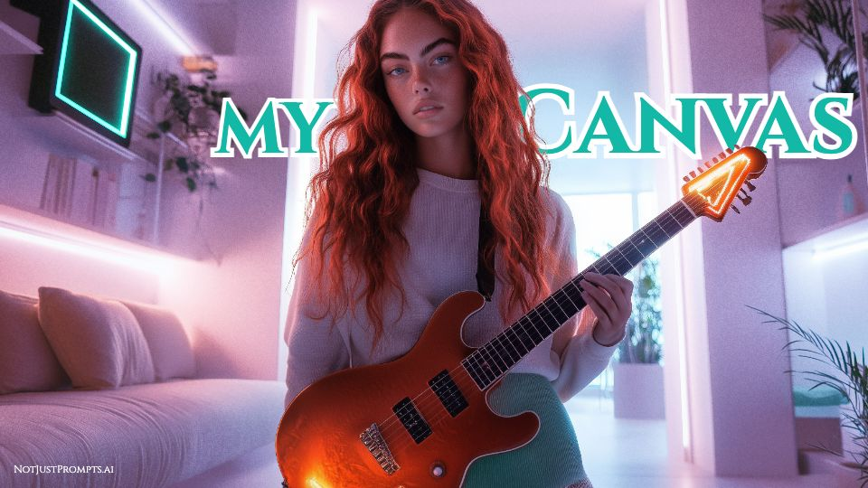

<p align="center">
  
</p>

<h1 align="center">MyCanvas</h1>

<p align="center">
  A local-first design tool for thumbnails and social graphics. Layer text with real<br />
  fonts and effects over images, drop in shapes, frames and logos, and export to PNG/JPG.<br />
  No accounts, no cloud, no subscription — your projects live as JSON on your disk.
</p>

## Requirements

- **Node.js ≥ 22** and npm.
- A modern browser — **Chrome or Edge recommended**. The AI features use WebGPU when
  available and fall back to WASM elsewhere (slower, still works). On first use the
  models download once (~50 MB total) and are cached by the browser afterwards.
- Everything runs on your machine: designs, uploads and fonts never leave it.

## Quick start

```sh
npm install
npm run dev        # starts the API (:3001) and the web UI (:5173) together
```

Open http://localhost:5173, create a design, and start layering.
To run the apps separately: `npm run dev:server` / `npm run dev:web`.

## Features

**Canvas & layers**

- Layer types: text, images, rectangles, lines, shapes (triangle, hexagon, circle,
  semicircle, star) and frames — shape containers that clip an image, with
  double-click pan/zoom content editing.
- Move, resize, rotate, and multi-select with marquee (click-drag on empty canvas);
  group/ungroup (`Cmd/Ctrl+G`), with collapsible group rows in the layers panel.
- Smart guides: snapping to other layers' edges and centers and to the canvas
  center while dragging.
- Copy/paste (`Cmd/Ctrl+C` / `Cmd/Ctrl+V`), duplicate (`Cmd/Ctrl+D`), undo/redo,
  arrow-key nudge, align-to-page (horizontal and vertical independently), z-order
  controls, layer locking (`Cmd/Ctrl+Shift+L`), right-click context menus, and
  hover outlines that preview what you're about to select.
- Corner handles scale proportionally; side handles resize the container
  (text re-wraps, images crop) with a live preview.

**Typography**

- Every font installed on your system plus a curated Google Fonts library with
  per-font favorites.
- Bold/italic, alignment, line height, letter spacing, and fill color.
- Curved (bent) text along an arc, in either direction.
- Text effects — shadow, outline, echo, background, and glitch — with per-effect
  sliders for color, distance, angle, blur, spread and roundness.
- Edit in place: double-click any text and type directly on the canvas.

**Color**

- Unified color picker everywhere, with HEX and RGB input.
- "Document colors": swatches of every color already used in the design.
- "Photo colors": 5-color palettes extracted from each image on the canvas,
  ranked so the dominant image's palette comes first.

**AI tools (100% local, in-browser)**

- **Remove background** — one-click subject cutout.
- **Text behind subject** — the editorial effect: your heading slips behind the
  person or object in the photo, automatically.
- **Portrait mode** — depth-based background blur with a strength slider.
- All inference runs in a Web Worker via transformers.js (WebGPU, WASM fallback),
  so the canvas never stutters. Originals are always preserved — every AI result
  is a new, undoable asset.

**Images & assets**

- Drag image files straight from the filesystem onto the canvas — they upload and
  land where you drop them. Dropping onto a frame fills it; dropping near the
  canvas edge sets the image as the full-canvas background.
- A reusable Uploads library per installation, with original filenames kept.
- Image cropping via side handles; corner radius on shapes and frames.

**Projects & export**

- Project list with thumbnails, duplicate and delete.
- Aspect-ratio presets for new designs: 1:1, 16:9, 9:16, 21:9, 9:21, 4:3, 3:4.
- Export to PNG or JPG at 0.25x–3x resolution with a JPG quality slider and a live
  file-size estimate — handy when a platform rejects an upload for being too heavy.
- Debounced autosave with thumbnails; refresh-safe.
- Light and dark themes, OS-aware and persisted.

## Layout

- `apps/server` — Hono API. Data lives in `apps/server/data/` (`designs/*.json`,
  `assets/*`, `settings.json`). Back it up or git-track it if you like.
- `apps/web` — React + react-konva editor (Vite).
- `packages/shared` — types, aspect-ratio presets, curated Google Fonts list.

## Checks

```sh
npm run check   # eslint (strict, zero-warning) + tsc across workspaces
npm run build   # production build of all workspaces
```

Note: `konva@^10.3.1` is pinned past a `min-release-age=7` npm window; if a fresh
install ever complains, run `npm install --min-release-age=0` once.
